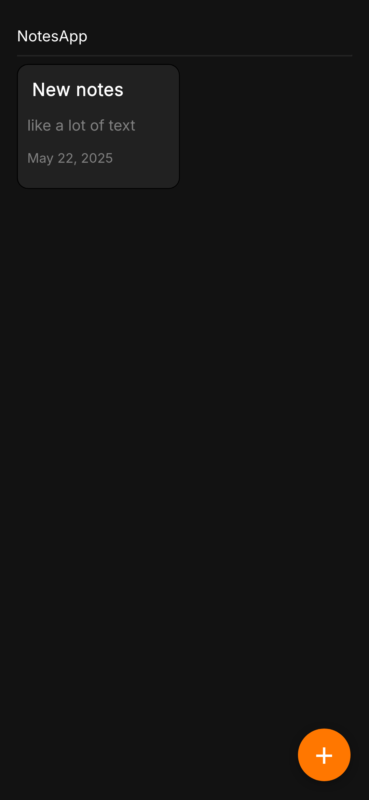
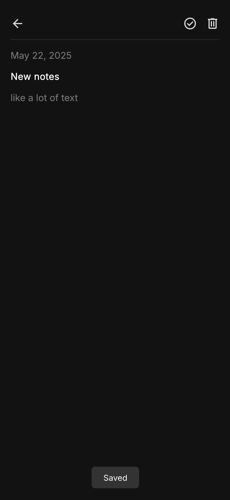

# 📒 NotesApp
English:
A minimalist note-taking app built with pure HTML, CSS, and JavaScript.  
All data is stored locally in `localStorage`. No backend, no build tools — just open and use.

Russian:
Минималистичное приложение для заметок, сделанное на чистом HTML, CSS и JavaScript.  
Все данные сохраняются локально через `localStorage`. Без бэкенда и сборщиков — просто открой и пользуйся.

---

## 🌐 Live Demo / Онлайн-версия

👉 [https://yarchefis.github.io/NotesApp-web-project/](https://yarchefis.github.io/NotesApp-web-project/)

---

## 📸 Screenshots / Скриншоты

<table width="100%">
  <tr>
    <td width="50%" align="center">
      
    </td>
    <td width="50%" align="center">
      
    </td>
  </tr>
</table>

---

## 🚀 Features / Возможности

- View all notes as cards / Просмотр всех заметок в виде карточек  
- Create and edit notes / Создание и редактирование заметок  
- Inline editing (no input fields) / Редактирование прямо в тексте (`contenteditable`)  
- Save with one click ✅ / Сохранение одним кликом  
- Delete notes with confirmation 🗑 / Удаление с подтверждением  
- Persistent data in `localStorage` / Данные хранятся в `localStorage`  
- Responsive and mobile-friendly / Адаптивный интерфейс для телефонов  

---

## 📦 How to Run Locally / Как запустить локально

### 1. Clone the repo / Клонируйте репозиторий

```bash
git clone https://github.com/yarchefis/NotesApp-web-project.git
cd NotesApp-web-project
```

### 2. Start a local server / Запустите локальный сервер
```bash
# For Python 3.x
python3 -m http.server
```


Then open your browser at:
http://localhost:8000

take a look at my website. There are even more interesting projects there    
загляните ко мне на сайт. Там еще больше интересных проектов    
[https://yardev.pw](https://yardev.pw)
